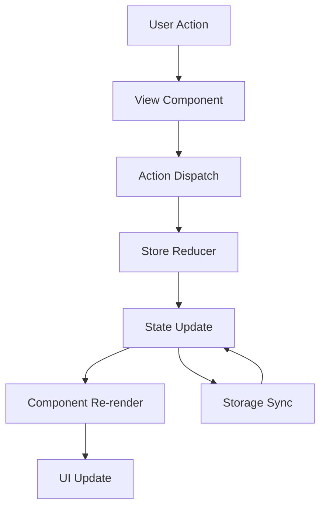

# Guía de Arquitectura - TúImpostor 📚

Esta guía detalla la arquitectura técnica del proyecto, explicando cada archivo y su propósito dentro del sistema.

## 🏗️ Arquitectura General

TúImpostor utiliza una **arquitectura SPA (Single Page Application)** con **state management Redux-like**. El proyecto está dividido en capas bien definidas que separan responsabilidades:

```
┌─────────────────────────────────────┐
│           PRESENTACIÓN               │
│  (Views, UI Components, Styling)    │
├─────────────────────────────────────┤
│            LÓGICA DE NEGOCIO         │
│   (Game Engine, Store, Actions)     │
├─────────────────────────────────────┤
│           INFRAESTRUCTURA            │
│  (Routing, Storage, DOM Utils)     │
└─────────────────────────────────────┘
```

## 📁 Estructura Detallada

### 🚀 Entry Points

#### `index.html`
- **Propósito**: Punto de entrada HTML de la aplicación
- **Contenido**: 
  - Metadatos básicos (charset, viewport, theme-color)
  - Cache control headers para evitar problemas de caché
  - Referencia al script principal (`/src/main.js`)
  - Estructura básica con contenedor `#app`

#### `src/main.js`
- **Propósito**: Bootstrap y ciclo de vida de la aplicación
- **Responsabilidades**:
  - Inicializar el store de Redux
  - Configurar el router
  - Establecer listeners de eventos globales
  - Manejar el ciclo de vida (focus/blur, beforeunload)
  - Iniciar la aplicación

#### `src/app.js`
- **Propósito**: Configuración principal de la aplicación
- **Responsabilidades**:
  - Definir rutas y sus componentes
  - Configurar middleware del router
  - Establecer layout principal
  - Manejar errores de routing

### 🧭 Sistema de Navegación

#### `src/router.js`
- **Propósito**: Sistema de routing client-side
- **Responsabilidades**:
  - Parsear URLs y determinar rutas
  - Manejar navegación programática
  - Actualizar history del navegador
  - Integrarse con el store para estado de navegación

### 🎨 Sistema de UI

#### `src/ui.js`
- **Propósito**: Utilidades de interfaz de usuario
- **Responsabilidades**:
  - Funciones helper para manipulación del DOM
  - Utilidades de animación y transiciones
  - Manejo de eventos de UI
  - Funciones de accesibilidad

#### `src/dom/el.js`
- **Propósito**: Sistema de creación de elementos DOM
- **Responsabilidades**:
  - Función `el()` para crear elementos con sintaxis declarativa
  - Manejo automático de eventos y atributos
  - Optimización de renderizado
  - Soporte para componentes anidados

### 🗄️ State Management (Redux-like)

#### `src/store/store.js`
- **Propósito**: Store principal de Redux
- **Responsabilidades**:
  - Mantener el estado global de la aplicación
  - Dispatch de actions
  - Suscripción a cambios de estado
  - Integración con middleware

#### `src/store/reducer.js`
- **Propósito**: Reducer principal de Redux
- **Responsabilidades**:
  - Manejar todas las actions y actualizar estado
  - Lógica de inmutabilidad del estado
  - Combinación de reducers específicos
  - Manejo de efectos secundarios

#### `src/store/actions.js`
- **Propósito**: Definición de todas las actions
- **Responsabilidades**:
  - Constants de action types
  - Action creators
  - Tipado de payloads
  - Documentación de acciones

#### `src/store/initialState.js`
- **Propósito**: Estado inicial de la aplicación
- **Responsabilidades**:
  - Definir estructura del estado
  - Valores por defecto
  - Configuración inicial
  - Validación de estructura

### 🎮 Lógica del Juego

#### `src/game/engine.js`
- **Propósito**: Motor principal del juego
- **Responsabilidades**:
  - Lógica de reglas del juego
  - Gestión de turnos
  - Validación de movimientos
  - Cálculo de estados de juego

#### `src/game/draft.js`
- **Propósito**: Sistema de draft de jugadores
- **Responsabilidades**:
  - Asignación aleatoria de roles
  - Distribución de palabras
  - Validación de configuraciones
  - Balance de juego

### 📂 Sistema de Categorías

#### `src/categories/data.js`
- **Propósito**: Datos y gestión de categorías
- **Responsabilidades**:
  - Categorías predefinidas
  - Palabras por categoría
  - Validación de datos
  - Extensión de categorías personalizadas

#### `src/categories/actions.js`
- **Propósito**: Actions específicas de categorías
- **Responsabilidades**:
  - CRUD de categorías
  - Selección de categorías para juego
  - Validación de configuración
  - Persistencia de categorías

### 💾 Sistema de Persistencia

#### `src/storage/persist.js`
- **Propósito**: Sistema de persistencia local
- **Responsabilidades**:
  - Guardado/lectura de localStorage
  - Serialización/deserialización de datos
  - Manejo de errores de almacenamiento
  - Migración de datos

#### `src/storage/sync.js`
- **Propósito**: Sincronización de datos
- **Responsabilidades**:
  - Sincronización entre dispositivos
  - Manejo de conflictos
  - Estrategias de merge
  - Detección de cambios

### 🖼️ Vistas (Components)

#### `src/views/newGame.js`
- **Propósito**: Vista de configuración de nueva partida
- **Responsabilidades**:
  - Formulario de configuración
  - Validación de inputs
  - Selección de categorías
  - Inicio del juego

#### `src/views/round.js`
- **Propósito**: Vista principal de juego por rondas
- **Responsabilidades**:
  - Display de jugador actual
  - Sistema de revelación (flip cards)
  - Navegación entre jugadores
  - Interacciones de juego

#### `src/views/categoryDetail.js`
- **Propósito**: Vista de detalle de categoría
- **Responsabilidades**:
  - Listado de palabras
  - Edición de categorías
  - Estadísticas
  - Gestión de contenido

#### `src/views/settings.js`
- **Propósito**: Vista de configuración
- **Responsabilidades**:
  - Preferencias de usuario
  - Configuración de app
  - Reset de datos
  - Información del sistema

#### `src/views/notFound.js`
- **Propósito**: Vista de error 404
- **Responsabilidades**:
  - Manejo de rutas no encontradas
  - Navegación de recuperación
  - Información de error

### ⚙️ Configuración y Utilidades

#### `src/config.js`
- **Propósito**: Configuración global de la aplicación
- **Responsabilidades**:
  - Constants de configuración
  - Variables de entorno
  - Settings de desarrollo/producción
  - Feature flags

#### `src/lifecycle.js`
- **Propósito**: Manejo del ciclo de vida
- **Responsabilidades**:
  - Eventos del navegador
  - Manejo de focus/blur
  - Cleanup de recursos
  - Persistencia automática

## 🔄 Flujo de Datos



## 🎯 Patrones de Diseño

### 1. Redux-like State Management
- **Unidirectional Data Flow**: Las acciones fluyen en una sola dirección
- **Immutable State**: El estado nunca se modifica directamente
- **Pure Functions**: Los reducers son funciones puras

### 2. Component-based Architecture
- **Separation of Concerns**: Cada vista maneja su propia lógica
- **Reusable Components**: Utilidades compartidas entre vistas
- **Declarative UI**: DOM creado mediante declaración, no imperación

### 3. Observer Pattern
- **Event-driven Architecture**: Reactividad basada en eventos
- **Loose Coupling**: Componentes no dependen directamente entre sí
- **Scalability**: Fácil agregar nuevos componentes

## 🔧 Principios SOLID Aplicados

### Single Responsibility Principle
- Cada archivo tiene una responsabilidad única y bien definida
- Ejemplo: `categories/data.js` solo maneja datos de categorías

### Open/Closed Principle
- El sistema está abierto para extensión pero cerrado para modificación
- Ejemplo: Se pueden agregar nuevas categorías sin modificar el engine

### Liskov Substitution Principle
- Los componentes pueden ser reemplazados por otros similares
- Ejemplo: Cualquier vista puede ser usada en el router

### Interface Segregation Principle
- Las interfaces son pequeñas y específicas
- Ejemplo: `storage/persist.js` solo maneja persistencia

### Dependency Inversion Principle
- Los módulos de alto nivel no dependen de los de bajo nivel
- Ejemplo: Las vistas dependen del store, no de implementaciones específicas

## 🚀 Performance Considerations

### 1. Virtual DOM
- El sistema `el()` crea un DOM virtual eficiente
- Solo se renderizan los cambios necesarios

### 2. Lazy Loading
- Las vistas se cargan bajo demanda
- Reducción del bundle inicial

### 3. State Memoization
- El store optimiza actualizaciones de estado
- Evita renders innecesarios

### 4. Event Delegation
- Los eventos se manejan de forma delegada
- Mejor performance en listas grandes

---

Esta guía está diseñada para ayudar a nuevos desarrolladores a entender rápidamente la arquitectura del proyecto y poder contribuir de manera efectiva.
