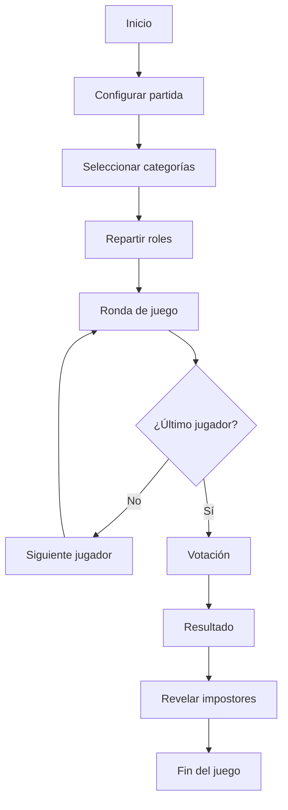

# TúImpostor 🕵️‍♂️

[](https://opensource.org/licenses/MIT)
[](https://vercel.com/)
[](https://developer.mozilla.org/es/docs/Web/JavaScript)
[](https://vitejs.dev/)

Un juego social multijugador donde debes descubrir quién es el impostor entre vosotros. Perfecto para reuniones con amigos, team building y eventos sociales.

## 🎮 ¿Cómo jugar?

1. **Configura la partida**: Elige el número de jugadores (mínimo 3) y la cantidad de impostores
2. **Selecciona categorías**: Elige entre múltiples categorías de palabras para la partida
3. **Reparte roles**: Cada jugador recibe su rol en secreto (impostor o palabra secreta)
4. **Juega**: Los jugadores intentan descubrir quiénes son los impostores mediante preguntas y deducciones
5. **Vota**: Al final, votan a quién creen que es el impostor

### 🎯 Mecánicas del juego

- **Impostores**: No reciben ninguna palabra, deben improvisar y engañar a los demás
- **Jugadores normales**: Reciben una palabra secreta que deben describir sin decirla
- **Votación**: Basada en las descripciones y comportamiento, se vota al impostor

## ✨ Características

### � Gameplay

- **Múltiples categorías**: Oficina, Viajes, Comida, Películas, Apps, Animales
- **Jugadores personalizables**: Desde 3 jugadores en adelante
- **Impostores configurables**: Elige cuántos impostores habrá en la partida
- **Modo revelación**: Mantén presionado para ver tu palabra o rol de impostor

### 🎨 Experiencia de usuario

- **Interfaz responsive**: Funciona perfectamente en móviles y escritorio
- **Diseño moderno**: UI oscura con acentos morados y animaciones suaves
- **Feedback visual**: Tarjetas flip para revelación de roles
- **Navegación intuitiva**: SPA con routing client-side

### 💾 Características técnicas

- **Persistencia local**: Guarda tu progreso y configuraciones
- **State management**: Arquitectura Redux-like para lógica pura
- **Multiplataforma**: Web y Android con Capacitor
- **Build optimizado**: Vite para desarrollo rápido y producción optimizada

## 🚀 Demo

Juega online: [https://tuimpostor.vercel.app/](https://tuimpostor.vercel.app/)

También disponible en: [https://pochonski.github.io/TuImpostor/](https://pochonski.github.io/TuImpostor/)

## 🛠️ Stack tecnológico

### Frontend

- **JavaScript vanilla** (ES6+)
- **HTML5** con semántica moderna
- **CSS3** con variables CSS y flexbox/grid
- **Vite 6.4.1** como build tool

### Arquitectura

- **SPA** con routing client-side
- **Redux-like state management** (store, reducer, actions)
- **Component-based architecture** con DOM virtual
- **Pattern Observer** para reactividad

### Mobile

- **Capacitor 8.2.0** para Android
- **WebView optimizado** para experiencia nativa

### Deploy & DevOps

- **Vercel** para deployment automático
- **GitHub Actions** para CI/CD
- **GitHub Pages** como alternativa

## 📦 Instalación local

### Prerrequisitos

- Node.js 18+
- npm o yarn

### Pasos

```bash
# Clona el repositorio
git clone https://github.com/Pochonski/TuImpostor.git
cd TuImpostor

# Instala dependencias
npm install

# Inicia servidor de desarrollo
npm run dev
```

Abre `http://localhost:5173` en tu navegador.

### Scripts disponibles

```bash
npm run dev      # Servidor de desarrollo
npm run build    # Build para producción
npm run preview  # Preview del build local
```

## 📱 Desarrollo para Android

### Prerrequisitos

- Android Studio
- Java JDK 11+
- Android SDK

### Pasos

```bash
# Construye la app web
npm run build

# Sincroniza con Capacitor
npx cap sync android

# Abre en Android Studio
npx cap open android
```

### Build y release

```bash
# Build APK para desarrollo
npx cap build android

# Build AAB para Play Store
npx cap build android --release
```

## 🏗️ Estructura del proyecto

```
src/
├── app.js              # Entry point de la aplicación
├── main.js             # Bootstrap y lifecycle
├── router.js           # Sistema de routing
├── ui.js               # Utilidades de UI
├── config.js           # Configuración global
├── lifecycle.js        # Manejo de ciclo de vida
├── categories/         # Sistema de categorías
│   ├── data.js         # Categorías predefinidas
│   └── actions.js      # Actions de categorías
├── dom/                # Sistema de DOM
│   └── el.js           # Creación de elementos
├── game/               # Lógica del juego
│   ├── engine.js       # Motor del juego
│   └── draft.js        # Draft de jugadores
├── storage/            # Persistencia
│   ├── persist.js      # Guardado local
│   └── sync.js         # Sincronización
├── store/              # State management
│   ├── store.js        # Store principal
│   ├── reducer.js      # Reducer
│   ├── actions.js      # Actions
│   └── initialState.js # Estado inicial
└── views/              # Vistas de la app
    ├── newGame.js      # Nueva partida
    ├── round.js        # Ronda de juego
    ├── categoryDetail.js # Detalle de categoría
    ├── settings.js     # Configuración
    └── notFound.js     # 404
```

## 🎯 Categorías disponibles

### 📊 Estadísticas

- **6 categorías predefinidas**
- **500+ palabras únicas**
- **Extensible** mediante JSON

### 📋 Lista de categorías

1. **Oficina** (23 palabras): Reunión, Café, Correo, Jefe, etc.
2. **Viajes** (23 palabras): Avión, Hotel, Maleta, Pasaporte, etc.
3. **Comida** (58 palabras): Pizza, Hamburguesa, Tacos, Sushi, etc.
4. **Películas** (43 palabras): Popcorn, Cine, Película, Actor, etc.
5. **Apps** (58 palabras): WhatsApp, Instagram, Facebook, Twitter, etc.
6. **Animales** (71 palabras): Perro, Gato, León, Tigre, Elefante, etc.

## 🎨 Guía de estilos

### Colores

- **Primario**: `#8b5cf6` (morado)
- **Secundario**: `#6b7280` (gris)
- **Fondo**: `#0b1220` (oscuro)
- **Texto**: `#ffffff` (blanco)
- **Acentos**: `#ef4444` (rojo para danger)

### Tipografía

- **Títulos**: Sistema, bold
- **Texto**: Sistema, regular
- **Tamaños**: Responsive con clamp()

### Componentes

- **Botones**: `.btn`, `.btn-primary`, `.btn-secondary`, `.btn-danger`
- **Tarjetas**: `.card`, `.flip-card`
- **Acciones**: `.actions` (contenedor de botones)

## 🔄 Flujo de estado



## 🎯 Ideal para

- **Reuniones con amigos** 👨‍👩‍👧‍👦
- **Team building** 🏢
- **Fiestas y eventos sociales** 🎉
- **Actividades educativas** 📚
- **Ice breakers** 🧊
- **Clases y talleres** 🎓

## 🤝 Contribuir

### ¿Cómo contribuir?

1. **Fork** el repositorio
2. **Crea** una feature branch (`git checkout -b feature/amazing-feature`)
3. **Commit** tus cambios (`git commit -m 'Add some amazing feature'`)
4. **Push** al branch (`git push origin feature/amazing-feature`)
5. **Abre** un Pull Request

### 🐛 Reportar bugs

Usa el [issue tracker](https://github.com/Pochonski/TuImpostor/issues) para reportar bugs o sugerir features.

### 💡 Ideas para mejorar

- [ ] Modo multijugador online
- [ ] Más categorías de palabras
- [ ] Sistema de puntos y rankings
- [ ] Modo timer para cada ronda
- [ ] Animaciones mejoradas
- [ ] Modo dark/light theme
- [ ] Internacionalización (i18n)

## 📄 Licencia

MIT License - puedes usar este proyecto para lo que quieras.

```
Copyright (c) 2024 Pochonski

Permission is hereby granted, free of charge, to any person obtaining a copy
of this software and associated documentation files (the "Software"), to deal
in the Software without restriction, including without limitation the rights
to use, copy, modify, merge, publish, distribute, sublicense, and/or sell
copies of the Software, and to permit persons to whom the Software is
furnished to do so, subject to the following conditions:

The above copyright notice and this permission notice shall be included in all
copies or substantial portions of the Software.
```

## 📞 Contacto

**Hecho con ❤️ por [Pochonski](https://github.com/Pochonski)**

- 📧 [GitHub Issues](https://github.com/Pochonski/TuImpostor/issues)
<<<<<<< HEAD
=======

>>>>>>> 46c4066b55bedf36457f1d1e418cb9c472d5c7bd

---

⭐ **Si te gusta el proyecto, no olvides darle una estrella en GitHub!** ⭐
